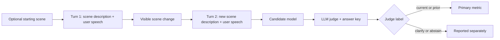

# Wearable Assistant Context Bench

[](https://github.com/n-dryer/wearable-assistant-context-bench/actions/workflows/test.yml)
[](https://www.python.org/downloads/)
[](LICENSE)

A model-selection benchmark for live AI wearable assistants.

Wearable assistants need to keep up while a user talks and moves. A user might ask about a tool, look at a screen, walk to another place, or pick up a different object without explaining the change out loud. The assistant should actively use the latest audio, video, and text context, so the user does not have to narrate every shift.

This benchmark tests one part of that problem: cross-turn reference resolution. Can a model answer the next question using the scene the user means now?

The benchmark uses text transcripts of speech and text scene descriptions of video frames.

## Quick links

| Need | Start here |
|---|---|
| Read the benchmark design | [`docs/benchmark_spec.md`](docs/benchmark_spec.md) |
| Review methodology | [Methodology](#methodology) |
| Configure API keys | [`docs/api_keys.md`](docs/api_keys.md) |
| Run open-weight models | [`docs/running_models.md`](docs/running_models.md) |
| Look up a term | [`docs/glossary.md`](docs/glossary.md) |
| Report an issue | [GitHub Issues](https://github.com/n-dryer/wearable-assistant-context-bench/issues) |

## Quick Start

Requires Python 3.11+. The fastest path uses [`uv`](https://docs.astral.sh/uv/), Astral's Python project manager.

This benchmark runs from a repo clone. After install, run `wac-bench` from the repo root. Task data lives in `data/` and is loaded by relative path.

### Install with uv (recommended)

```bash
git clone https://github.com/n-dryer/wearable-assistant-context-bench.git
cd wearable-assistant-context-bench

uv sync --extra dev
cp .env.example .env   # then add your provider keys
uv run wac-bench --help
```

`uv sync` creates the virtual environment, resolves and installs all dependencies, and registers the `wac-bench` console command in one step. The test suite does not require API access:

```bash
uv run pytest -q
```

### Install with pip

```bash
python -m venv .venv
source .venv/bin/activate
pip install -e ".[dev]"
cp .env.example .env
wac-bench --help
```

All runs default to temperature 0.0 for reproducibility. See [`docs/api_keys.md`](docs/api_keys.md) for provider-specific key setup.

### Run a candidate model

```bash
wac-bench --model <candidate_model_id>
```

For open-weight Hugging Face models, see [`docs/running_models.md`](docs/running_models.md).

### Common commands

```bash
pytest -q                             # Run tests
python scripts/validate_tasks.py  # Validate the task set
wac-bench --help                      # Show runner options
```

## Benchmark design

This section explains what the benchmark sends to the model, how the tasks work, and how responses are scored.

### Inputs

- Audio is represented as text transcripts.
- Video is represented as written scene descriptions, injected into the user turn as `[Camera: ...]` blocks.

For the full input design, see [`docs/benchmark_spec.md`](docs/benchmark_spec.md).

### Evaluation flow



### Methodology

The benchmark is a text-mediated visual context evaluation. It does not send raw audio, images, or video to the candidate model. Audio is represented as user transcript text. Video is represented as scene-description text injected into user turns as `[Camera: ...]` blocks.

Each task is a two-turn conversation:

| Turn | Role |
|---|---|
| Turn 1 | Establishes the starting scene and user request |
| Turn 2 | Changes the visible context and asks the scored follow-up question |

Turn 2 is the only scored turn.

The candidate model sees only the user transcript and scene-description text. The judge sees the same conversation plus judge-only reference answers. The candidate never sees the reference answers, `gold_label` value, shift type, authoring notes, or other privileged metadata.

The benchmark ships three prompt conditions:

| Condition | Purpose |
|---|---|
| `baseline` | Minimal assistant prompt and default ranking condition |
| `context_selection_instruction` | Context-selection instruction before answering |
| `pre_answer_context_scaffold` | Pre-answer scaffold that asks the model to name the relevant context before answering |

The primary metric is mean recall over the `current` and `prior` labels under the `baseline` condition:

```text
primary_score = mean(current_recall, prior_recall)
```

The `clarify` and `abstain` labels are reported as auxiliary behavior. They help show whether a model asks for clarification or refuses when the task calls for that behavior, but they do not enter the primary score.

The judge is an LLM-as-judge classifier. It assigns one label to each Turn 2 response: `current`, `prior`, `clarify`, or `abstain`. By default, `--judge-family auto` chooses a judge from a different model family than the candidate to reduce self-preference risk. For model ranking, use `--ranking-judge-family` so every candidate is also labeled by the same judge family.

Task validation has two layers:

- Programmatic checks run through `scripts/validate_tasks.py`: schema validation, token-leakage checks, object-name checks in scene descriptions, duplicate checks, and manifest-lock drift.
- Authoring checks review whether scene descriptions identify the intended object without naming it and whether Turn 2 can be answered without relying on the intended context history.

Official model results should be generated only after the task set, prompt conditions, judge prompt, and manifest are locked. Raw run outputs should stay out of the public repo unless they are part of a curated official result release.

### Tasks

Each task is a three-turn conversation. Between Turn 1 and Turn 2, the user changes what they are holding, viewing, doing, or referring to. The user does not spell out the change. The model has to answer the Turn 2 question using the scene the user means at that moment.

The scene descriptions include visible details such as shape, material, color, motion, and position. They avoid naming the object directly.

The current task bank contains 166 tasks. The pinned distribution covers 8 shift types and includes both straightforward references and distractor-rich cases where the earlier object or scene may still be visible.

The task bank covers 8 shift types: `object_in_hand`, `object_state`, `sequential_task`, `location`, `object_in_view`, `absent_referent`, `screen_content`, and `cross_session_reference`.

For category counts, task fields, and authoring rules, see the [dataset card](data/README.md), [schema](docs/schema.md), and [authoring rules](docs/task_authoring.md).

### Scoring and judging

Each task is scored on Turn 2, after the scene changes.

| Label | Meaning |
|---|---|
| `current` | The response answers using the new scene |
| `prior` | The response answers using the earlier scene |
| `clarify` | The response asks for clarification instead of answering |
| `abstain` | The response avoids answering |

```text
primary_score = mean(current_recall, prior_recall)
```

`current_recall` and `prior_recall` are per-class recall values (TP / (TP + FN)). Reports include a non-parametric bootstrap 95% CI on the primary metric in addition to the per-class Wilson CIs. `clarify` and `abstain` rates are reported separately.

By default (`--judge-family auto`), the judge comes from a different model family than the candidate. To rank candidates against each other, add `--ranking-judge-family` for one judge held constant across all of them.

## What this benchmark does not measure

Evaluate these separately:

- Coaching advice quality (correctness, safety, domain appropriateness)
- Multi-turn dynamics beyond three turns
- Raw video, image, or audio perception
- Latency, cost, and serving characteristics
- Speaker attribution, addressee detection, ambient audio

For the full scope statement, see [`docs/benchmark_spec.md`](docs/benchmark_spec.md#scope-boundaries).

## Code layout

| Path | Purpose |
|---|---|
| [`wearable_assistant_context_bench/`](wearable_assistant_context_bench) | Package: adapters, judge, scoring, aggregation, rendering, runner |
| [`data/`](data) | Frozen task set, prompt conditions, runtime config, lockfile |
| [`tests/`](tests) | Runtime and input-validation tests |
| [`scripts/`](scripts) | Helper scripts. See [`scripts/README.md`](scripts/README.md) |
| [`.env.example`](.env.example) | Environment variable template |

## Contributing

See [`CONTRIBUTING.md`](CONTRIBUTING.md) for the full policy. For bugs, failed reproduction attempts, or unclear documentation, open a GitHub issue with the command you ran, the model or provider used, and the relevant error output.

## License

Released under the MIT License. See [LICENSE](LICENSE).

## Citation

Maintained by Nate Dryer ([@n-dryer](https://github.com/n-dryer)).

If you reference this benchmark, use the citation metadata in [CITATION.cff](CITATION.cff) or copy the BibTeX entry below.

```bibtex
@software{dryer_wearable_assistant_context_bench_2026,
  author = {Dryer, Nate},
  title = {{Wearable Assistant Context Bench}},
  year = {2026},
  url = {https://github.com/n-dryer/wearable-assistant-context-bench},
  version = {0.1.0a0},
  license = {MIT}
}
```
